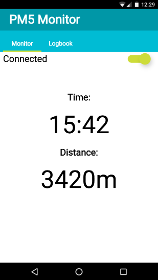

# Rowing Monitor

The Rowing Monitor is a [Progressive Web App](https://developers.google.com/web/#progressive-web-apps)
that uses [Web Bluetooth](https://webbluetoothcg.github.io/web-bluetooth/) to connect to a 
[PM5 Monitor](http://www.concept2.com/service/monitors/pm5) and tracking exercises.

It uses [IndexedDB](https://developer.mozilla.org/en/docs/Web/API/IndexedDB_API) to save exercises
to a logbook.

## Running the project

- `git clone https://github.com/GoogleChromeLabs/rowing-monitor.git`
- `cd rowing-monitor`
- `npm i`
- `npm run dev`

## How it works

The PM5 Monitor provides 4 different services: Discovery, Information, Rowing and Control

The Discovery Service is used to find PM5 Monitors available. The Information Service is
used to retrieve Monitor information, such as manufacturer, serial number, etc. The Rowing
service provides exercise information. 
  
## External References:
 - [PM5 Bluetooth Smart Interface Definition](http://www.concept2.co.uk/files/pdf/us/monitors/PM5_BluetoothSmartInterfaceDefinition.pdf)

## Contributing

See [CONTRIBUTING](./CONTRIBUTING.md) for more.

## License

See [LICENSE](./LICENSE) for more.

## Disclaimer

This is not a Google product.